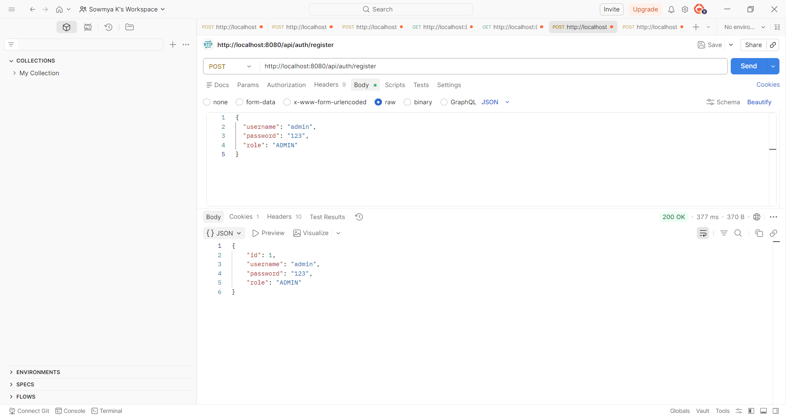
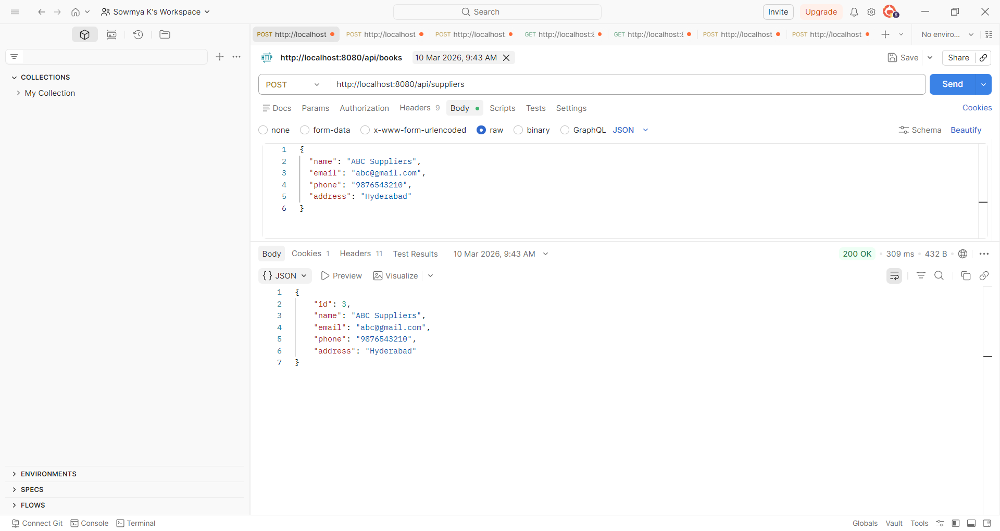
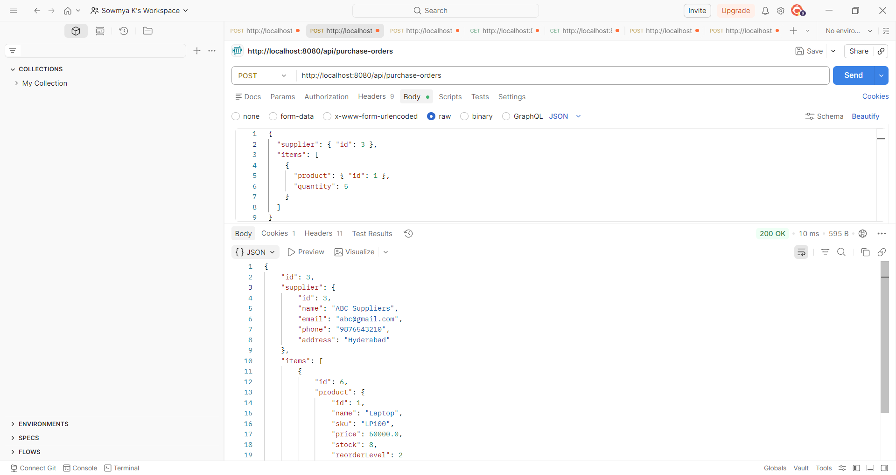
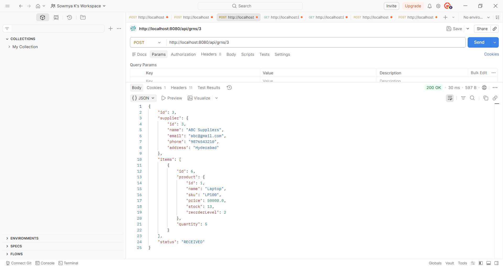

# 🚀 ERP Backend System (Spring Boot)

A full-featured **ERP (Enterprise Resource Planning) backend system** built using **Spring Boot**, supporting inventory management, sales, purchase orders, and secure authentication using JWT.

---

## 📌 Features

* 🔐 JWT Authentication & Role-Based Access (ADMIN / USER)
* 👥 Customer & Supplier Management
* 📦 Product & Inventory Management
* 🛒 Sales Order Processing
* 📥 Purchase Order & GRN (Goods Received Note)
* 🧾 Invoice Generation
* ⚡ Transaction Management (Stock updates automatically)
* ❌ Global Exception Handling

---

## 🛠️ Tech Stack

* **Backend:** Spring Boot, Spring Security, Spring Data JPA
* **Database:** PostgreSQL
* **Authentication:** JWT (JSON Web Token)
* **Build Tool:** Maven
* **Testing:** Postman / Hoppscotch

---

## 🔐 Authentication Flow

1. Register user
2. Login → Get JWT Token
3. Use token in headers for protected APIs

```http
Authorization: Bearer <your_token>
```

---

## 📸 API Demonstration

### 🔐 User Registration



---

### 📦 Supplier Creation



---

### 🛒 Purchase Order Creation



---

### 📉 Inventory Update (GRN)



---

## 📂 Project Structure

```
src/
 ├── controller
 ├── service
 ├── repository
 ├── model
 ├── config
 ├── security
 └── exception
```

---

## ⚙️ Setup Instructions

### 1️⃣ Clone the repository

```bash
git clone https://github.com/your-username/erp-backend.git
cd erp-backend
```

### 2️⃣ Configure database (application.properties)

```properties
spring.datasource.url=jdbc:postgresql://localhost:5432/erp_db
spring.datasource.username=your_username
spring.datasource.password=your_password

spring.jpa.hibernate.ddl-auto=update
```

### 3️⃣ Run the application

```bash
mvn spring-boot:run
```

---

## 🧪 API Testing

Use:

* Postman
* Hoppscotch

Test flow:

1. Register → `/api/auth/register`
2. Login → `/api/auth/login`
3. Copy JWT token
4. Add header:

   ```
   Authorization: Bearer <token>
   ```
5. Access protected APIs

---

## 🚀 Future Improvements

* Frontend integration (React)
* Swagger API Documentation
* Docker Deployment
* Advanced Reporting Dashboard

---

## 👩‍💻 Author

**Sowmya Kanaparthi**
B.Tech IT | Backend Developer | Spring Boot Enthusiast

---

## ⭐ If you like this project

Give it a ⭐ on GitHub!
